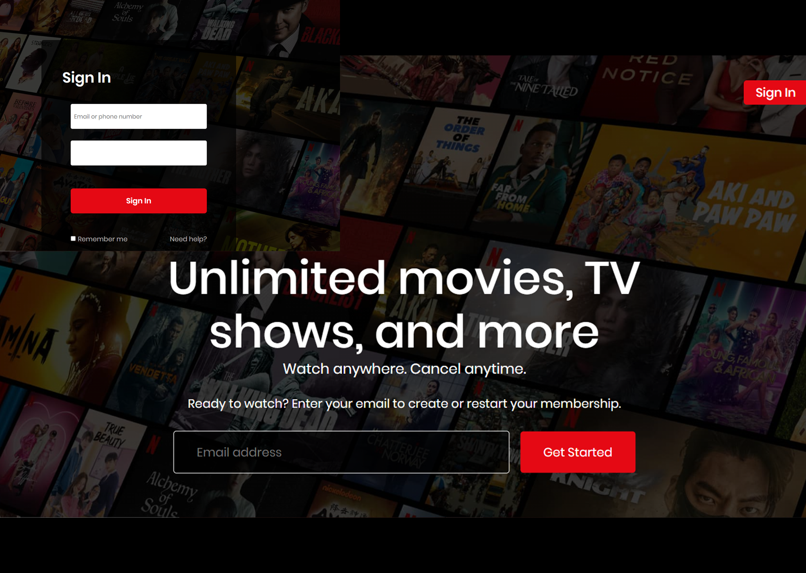

# WatchFlix
 Netflix Clone Landing Page

This is a clone of the Netflix landing page created using HTML and CSS. It mimics the design and layout of the original Netflix website.
Just wanna use this to improve on my html and css fundamental skill.

## Features

- Responsive design for various screen sizes
- Interactive elements and animations
- Similar layout to the original Netflix landing page

## Getting Started

To view the Netflix clone landing page, simply open the `index.html` file in your web browser.

If you wish to contribute or make modifications, follow these steps:

1. Clone the repository:

2. Open the project in your preferred code editor.

3. Make the necessary changes or additions.

4. Commit your changes:

5. Push your changes to the repository:

## Contributing

Contributions are welcome! If you have any suggestions, improvements, or bug fixes, please open an issue or submit a pull request.

## License

This project is licensed under the [MIT License](https://opensource.org/licenses/MIT).
